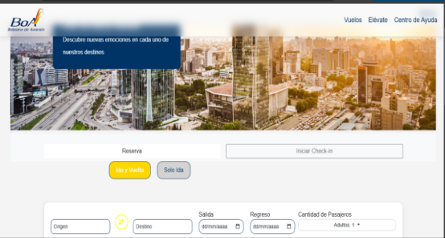
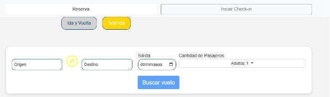
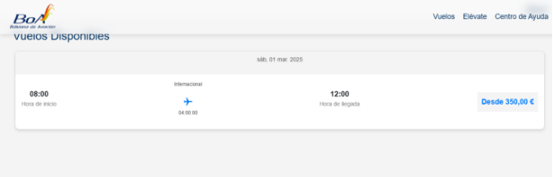
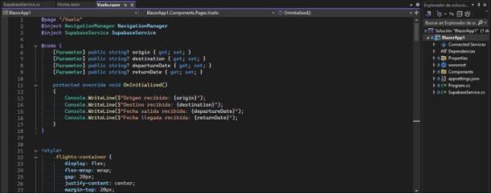
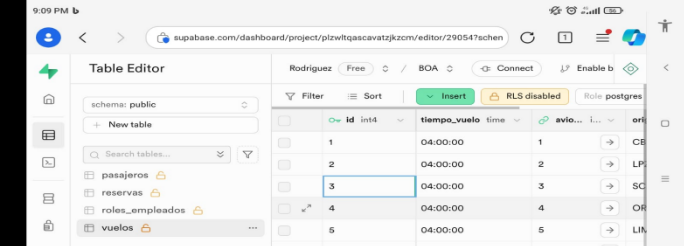

# **PROYECTO SOCIOFORMATIVO: RÉPLICA DE LA PÁGINA WEB DE BOA**
## **Desarrollo de un Sistema de Solicitud y Comprobante de Vuelo con Blazor y Supabase**
- Nombre: 	JULIO CESAR ARGANDOÑA
  - ADRIANA RODRIGUEZ SOTELO
  - RICARDO GUILLEN BEJARANO 
- Universidad: Universidad Privada Domingo Savio
- Carrera: Ingeniería de Sistemas
### **Objetivo**
Objetivo General: Desarrollar una plataforma web eficiente para la gestión y consulta de vuelos de Boliviana de Aviación (BOA) utilizando Blazor para la interfaz de usuario y Supabase para la base de datos y servicios backend.

**Objetivos específicos:**

1. Diseñar una interfaz de usuario interactiva y responsiva con Blazor .
1. Integrar Supabase para gestionar la base de datos de vuelos, usuarios y reservas.
1. Implementar autenticación de usuarios para gestionar reservas y consultar vuelos.
1. Demuestra una experiencia de usuario fluida y eficiente, mejorando la interacción con la plataforma.
1. Desarrollar un sistema de gestión para administradores, que permita agregar, editar y eliminar vuelos.
-----
### **Marco Teórico**
Blazor: Blazor es un framework para construir aplicaciones web interactivas utilizando C# en lugar de JavaScript . Utilice componentes reutilizables y puede ejecutarse tanto en el lado del cliente como en el servidor. En este proyecto, Blazor WebAssembly se utilizará para construir la interfaz de usuario interactiva.

Supabase: Supabase es una plataforma de desarrollo de código abierto que proporciona una base de datos en tiempo real y servicios como autenticación , almacenamiento de archivos y funciones de base de datos . Utiliza PostgreSQL como motor de base de datos y proporciona una API RESTful para interactuar con los datos de manera eficiente.

-----

### **Metodología**
El desarrollo del sistema sigue una metodología ágil (Scrum), con las siguientes fases:

1. Análisis y Diseño: Se definieron los requerimientos del sistema, así como las tecnologías a utilizar. Se realizaron diagramas de flujo y casos de uso.
1. Desarrollo de la interfaz de usuario (UI): Se construyó la interfaz utilizando Blazor . La UI permite consultar vuelos, realizar reservas y gestionar la cuenta de usuario.
1. Desarrollo de Backend: Se integró Supabase para gestionar la base de datos, la autenticación y el almacenamiento de datos en tiempo real. La API RESTful de Supabase fue utilizada para interactuar con los datos.
1. Pruebas y Ajustes: Se realizaron pruebas para validar el correcto funcionamiento de la plataforma, solucionando errores y optimizando el rendimiento.
-----
### **Modelado**
Diagrama de Tablas: Se crearon las siguientes tablas en la base de datos:

1. Vuelos:
   1. ID (clave principal)
   1. Origen
   1. Destino
   1. Fecha
   1. Hora de salida
   1. Hora de llegada
   1. Precio
1. Usuarios:
   1. ID (clave principal)
   1. Nombre
   1. Correo electrónico
   1. Contraseña (hash)
   1. Tipo de usuario (administrador/cliente)
1. Reservas:
   1. ID (clave principal)
   1. ID de vuelo (clave extranjera)
   1. ID de usuario (clave externa)
   1. Fecha de reserva

**Diagrama de Arquitectura:** El sistema utiliza una arquitectura de **cliente-servidor** en la que:

- Blazor actúa como el cliente (UI).
- Supabase actúa como el servidor (base de datos y servicios backend).
-----
### **Conclusiones**
El sistema de gestión de vuelos BOA ofrece una plataforma robusta y eficiente para la consulta y gestión de vuelos, con una interfaz de usuario interactiva y moderna. La integración de Blazor y Supabase ha permitido la creación de un sistema ágil, seguro y fácil de mantener. Los resultados obtenidos han demostrado una mejora significativa en la experiencia del usuario y una gestión más eficiente de los vuelos.

-----
### **Bibliografía**
1. [Microsoft . ](https://docs.microsoft.com/en-us/aspnet/core/blazor/)[( 2024 ](https://docs.microsoft.com/en-us/aspnet/core/blazor/)[)](https://docs.microsoft.com/en-us/aspnet/core/blazor/) . Documentación de [Blazor ](https://docs.microsoft.com/en-us/aspnet/core/blazor/)[. ](https://docs.microsoft.com/en-us/aspnet/core/blazor/)[Recuperado ](https://docs.microsoft.com/en-us/aspnet/core/blazor/)[de ](https://docs.microsoft.com/en-us/aspnet/core/blazor/)[: ](https://docs.microsoft.com/en-us/aspnet/core/blazor/)<https://docs.microsoft.com/en-us/aspnet/core/blazor/>
1. Supabase. (2024). Documentación de Supabase. Recuperado de : https://supabase.com/docs
1. S. Gill, RT (2023). Desarrollo de aplicaciones web con Blazor. Packt Publishing.
-----
###
###
### **Anexos**
1. Capturas de pantalla:
   1. Página principal del sistema de vuelos.

   1. **Vista de reserva de vuelos.**

1. **Panel de administración para gestionar vuelos.**

   

1. **Código relevante:**
   1. **Fragmento de código de Blazor para la visualización de vuelos.**

<h3>Vuelos Disponibles</h3>

@if (Vuelos is null)

{

`    `
Cargando vuelos...

}

else if (!Vuelos.Any())

{

`    `
No se encontraron vuelos disponibles.

}

else

{

`    `

`        `@foreach (var vuelo in Vuelos)

`        `{

`            `

`                `

`                    `
@vuelo.fecha\_salida.ToString("ddd, dd MMM. yyyy")

`                `

`                `

`                    `

`                        `
@vuelo.fecha\_salida.ToString("HH:mm")

`                        `
Hora de inicio

`                    `

`                    `

`                        `
@vuelo.tipo\_vuelo

`                        `✈

`                        `
@vuelo.tiempo\_vuelo

`                    `

`                    `

`                        `
@vuelo.fecha\_llegada.ToString("HH:mm")

`                        `
Hora de llegada

`                    `

`                    `

`                        `
Desde @vuelo.precio\_vuelo.ToString("C")

`                    `

`                `
                

`            `

`        `}

`    `

1. }

1. Fragmento de código de Supabase para la gestión de reservas.

